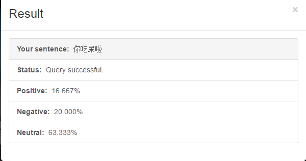
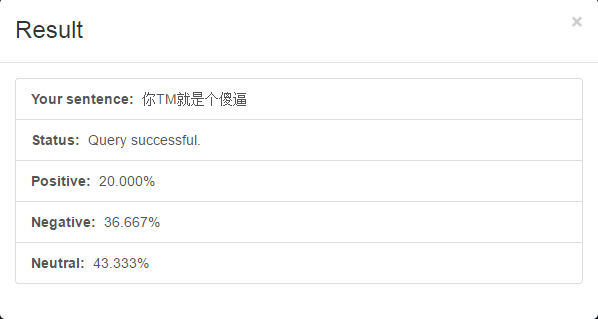
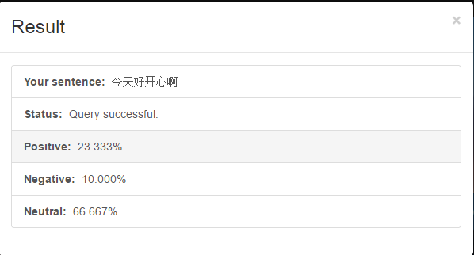
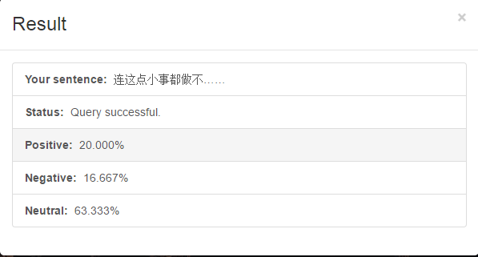

#DuDuLu

[English](README.md)

-----------


##简单介绍

DuDuLu是一个用于文本挖掘的web api server。目前提供一些用于获取基本文本信息的api，
视具体情况继续进行创新和优化。

同时该项目收录在我的另一个repositories里面。[ML and DM in action](https://github.com/MashiMaroLjc/ML-and-DM-in-action)

##当前版本

> 0.1.0
版本号解释
> 第一位为重构版本，第二位为功能版本，第三位为bug修复/功能优化版本


##API简介

- 分词API: /cut?sentence=""&method=""
 
 - sentence 为需要分词的句子
 - method=all 全模式分词
 - method=defaule 默认模式分词
 - method=search HMM模型分词
 - method=search_all HMM模型分词加全模式
 - 缺省时为默认模式分词

 返回的数据为json，其中各字段为为```status```请求状态，```info```错误时的错误信息，正确时该字段为空。```data```请求成功时为分词后的列表

- 词频统计Api: /count?sentence=""&method=""
 
 - 参数与分词模式一致

 返回的数据为json，其中各字段为为```status```请求状态，```info```错误时的错误信息，正确时该字段为空。```data```请求成功时为哈希表，key值是单词，
 value为该单词出现的频率。


- 情感分析api  /mood?sentence=""

 - sentence为长度1~200的句子

返回的数据为json，其中各字段为为```status```请求状态，```info```错误时的错误信息，正确时该字段为空。```data```请求成功时为哈希表，key值是情感极性,
包含积极，消极和中性三种情感极性，value为该极性的可能性。

以上api目前只支持中文

##环境依赖

+ python 3.4+
+ flask 0.10.1
+ jieba 0.38
+ numpy 

##如何使用

使用```git clone```命令或直接从本页面下载压缩包，然后再对应的目录输入```python dudulu.py```。

然后再浏览器中访问```localhost:8888```则可访问到用于测试情感分析api的测试页面。

##ToDoList

- [ ] 优化模型训练过程，尽可能使用脚本完成。
- [ ] 改进算法。

##Demo

[我搭建的api服务器](http://119.29.175.45:8888/)

##例子






